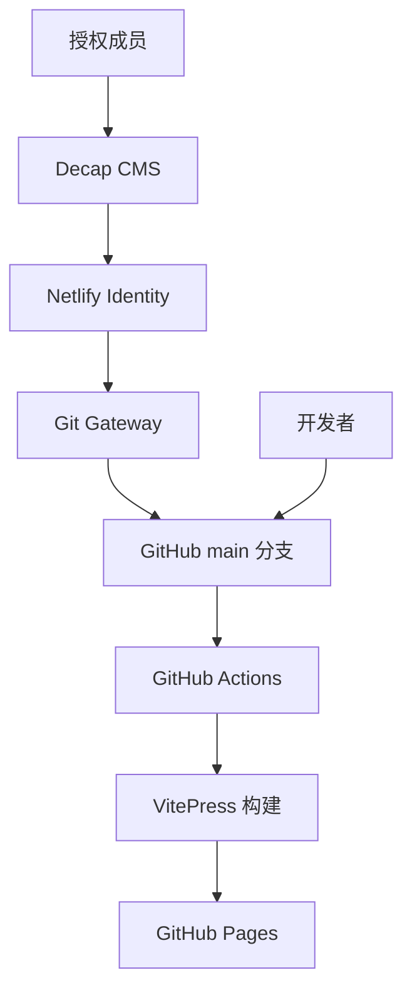

# Brother Union 官方网站

> 凝聚力量，共拓边界。

[](https://github.com/zoneli894-prog/BU--/actions/workflows/deploy.yml)
[](https://vitepress.dev/)
[](https://vuejs.org/)

Brother Union（BU）官方网站是一个面向组织成员与访客的中文信息门户，用于展示 BU 的发展历程、组织架构、成员风采、新闻动态、成员文章与共享资料。

项目基于 **VitePress + Vue 3** 构建，通过 **GitHub Actions** 自动部署至 GitHub Pages，并集成 **Decap CMS + Netlify Identity**，让获得授权的成员可以通过网页后台维护内容。

## 在线访问

- 官方网站：[https://zoneli894-prog.github.io/BU--/](https://zoneli894-prog.github.io/BU--/)
- 内容后台：[https://curious-brigadeiros-4f1d1a.netlify.app/admin/](https://curious-brigadeiros-4f1d1a.netlify.app/admin/)
- 项目仓库：[https://github.com/zoneli894-prog/BU--](https://github.com/zoneli894-prog/BU--)

> 内容后台采用邀请制。只有经管理员授权的账号才能登录和发布内容。

## 主要功能

- 组织首页：品牌介绍、轮播动态、组织愿景与常用入口
- 历史沿革：通过时间轴展示 BU 的发展历程
- 组织架构：展示主席团、秘书处、部门与顾问信息
- 人物介绍：维护成员资料、角色、任期与个人介绍
- 新闻动态：发布活动总结、成员专访与内部通告
- 成员文章：沉淀学术思考、成长感悟与活动复盘
- 资料库：集中展示组织文档和共享资源
- 2048 小游戏：以 BU 成员卡片为主题的网页小游戏，可从首页快捷入口进入
- 本地搜索：快速检索站内页面和文章
- 内容管理：授权成员可通过 CMS 编辑并发布内容
- 自动部署：`main` 分支更新后自动构建并发布网站

## 技术架构



| 模块 | 技术 | 用途 |
|---|---|---|
| 静态站点 | VitePress | 页面生成、Markdown 渲染与本地搜索 |
| UI 与交互 | Vue 3 | 轮播、时间轴、组织架构等自定义组件 |
| 内容数据 | Markdown / JSON | 保存文章、成员资料和结构化内容 |
| 内容后台 | Decap CMS | 提供可视化内容编辑界面 |
| 身份认证 | Netlify Identity | 管理受邀编辑者的登录权限 |
| 内容写入 | Git Gateway | 将 CMS 发布内容提交至 GitHub |
| 持续部署 | GitHub Actions | 自动安装依赖、构建并部署网站 |
| 站点托管 | GitHub Pages | 托管公开访问的静态网站 |

## 快速开始

### 环境要求

- Node.js 20 或更高版本
- npm
- Git

### 本地运行

```bash
git clone https://github.com/zoneli894-prog/BU--.git
cd BU--
npm ci
npm run dev
```

启动后，根据终端输出访问本地开发地址。

> VitePress 配置了 `/BU--` 基础路径。本地访问具体页面时，请以终端显示的地址为准。

### 构建与预览

```bash
npm run build
npm run preview
```

构建产物位于 `docs/.vitepress/dist/`。

## 项目结构

```text
.
├── .github/
│   └── workflows/
│       └── deploy.yml          # GitHub Pages 自动部署
├── docs/
│   ├── .vitepress/
│   │   ├── config.mts          # 站点与导航配置
│   │   └── theme/              # Vue 组件和全局样式
│   ├── articles/               # 成员文章
│   ├── data/                   # 时间轴、组织架构、首页数据
│   ├── history/                # 历史沿革页面
│   ├── members/                # 成员资料
│   ├── news/                   # 新闻动态
│   ├── public/
│   │   ├── 2048/               # BU 成员版 2048 小游戏（独立静态页面）
│   │   ├── admin/              # Decap CMS 后台配置
│   │   ├── favicon.svg         # 站点图标
│   │   ├── images/             # 图片等静态资源
│   │   └── logo.svg            # 站点 logo
│   ├── resources/              # 资料库
│   ├── structure/              # 组织架构页面
│   └── index.md                # 网站首页入口
├── package.json
└── package-lock.json
```

## 内容维护

### 通过 CMS 编辑

适合新闻、文章、成员资料和结构化内容的日常维护：

1. 使用受邀邮箱登录[内容后台](https://curious-brigadeiros-4f1d1a.netlify.app/admin/)。
2. 选择需要维护的内容集合。
3. 新建或编辑内容并点击 **Publish**。
4. CMS 通过 Git Gateway 将变更提交至 GitHub。
5. GitHub Actions 自动重新构建并部署网站。
6. 等待约 1–3 分钟后，在公开网站确认结果。

CMS 当前支持：

- 时间轴
- 组织架构
- 首页轮播与最新动态
- 人物介绍
- 成员文章
- 新闻动态

页面布局、动画、导航和全局样式不属于 CMS 内容，需要通过代码修改。

### 直接编辑内容文件

- 文章、新闻和成员资料使用 Markdown。
- 时间轴、组织架构和首页动态使用 JSON。
- 图片放置在 `docs/public/images/`，提交前应进行压缩。
- 修改 JSON 后建议先运行 `npm run build`，避免格式错误导致部署失败。

## 部署流程

推送到 `main` 分支后，`.github/workflows/deploy.yml` 会自动：

1. 检出仓库代码；
2. 安装 Node.js 20；
3. 安装项目依赖；
4. 执行 `npm run build`；
5. 上传 VitePress 构建产物；
6. 部署至 GitHub Pages。

部署状态可在仓库的 [Actions 页面](https://github.com/zoneli894-prog/BU--/actions)查看。

## 协作规范

为降低直接修改 `main` 带来的风险，建议使用以下流程：

```bash
git switch -c feat/short-description
# 完成修改并验证
npm run build
git add <相关文件>
git commit -m "feat: 简要描述本次改动"
git push -u origin feat/short-description
```

随后创建 Pull Request，说明：

- 修改目的；
- 涉及页面或内容；
- 本地验证结果；
- 视觉变更截图（如适用）。

推荐使用清晰的提交前缀：

| 前缀 | 用途 |
|---|---|
| `feat` | 新功能或新内容能力 |
| `fix` | 问题修复 |
| `docs` | 文档更新 |
| `style` | 不影响逻辑的样式调整 |
| `refactor` | 代码结构优化 |
| `chore` | 工具、依赖或维护工作 |

## 当前阶段

项目已完成第一阶段的主要目标：

- VitePress 官方网站可用；
- 内容与 Vue 组件基本解耦；
- Decap CMS 已覆盖核心内容类型；
- GitHub Pages 自动部署链路已经建立。

近期应优先完善现有链路的稳定性、文档一致性和协作规范，再评估是否需要引入更复杂的动态后台或全栈框架。

## 安全与隐私

- CMS 登录采用邀请制，但后台地址本身不是安全边界。
- 不要在 Markdown、JSON、前端代码或提交记录中存放密码、令牌及其他敏感信息。
- 发布成员资料、头像或联系方式前，应获得本人授权。
- CMS 发布会产生真实的 Git 提交；发布前请认真预览内容。

## 贡献者

感谢所有参与网站设计、开发、内容整理和维护的 BU 成员。

可在 [Contributors](https://github.com/zoneli894-prog/BU--/graphs/contributors) 页面查看贡献记录。

---

**Brother Union** · 非商业性质团体  
凝聚力量，共拓边界。
